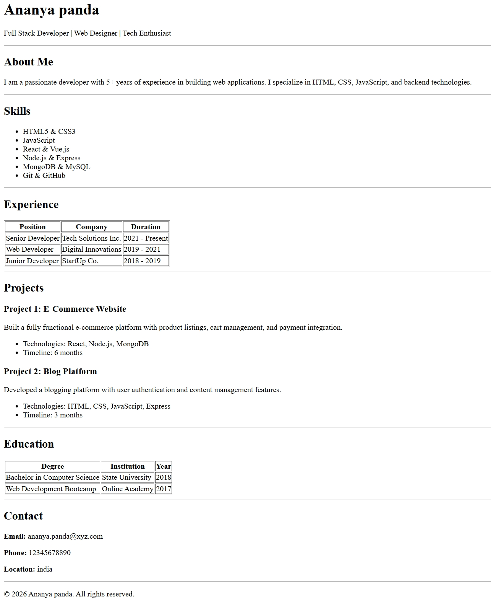

# Resume Project - Beginner's Guide

A simple, semantic HTML resume project built using pure HTML5 semantic tags.

##  Preview

Here's what the resume looks like:

 

##  What I Learned

In this project, I learned about:

1. Semantic HTML5 tags
2. How to structure a resume using sections
3. Clean and readable HTML code
4. Using lists and tables for formatting

### Semantic tags used

- `<header>` - For top section with name and title
- `<main>` - For the main resume content
- `<section>` - For organizing different parts of the resume
- `<article>` - For individual projects
- `<table>` - For experience and education
- `<address>` - For contact information
- `<footer>` - For copyright
- `<hr>` - For separation between sections

##  Project Steps

### Step 1: Set up the basic HTML structure
- Created an `index.html` file
- Added the basic HTML5 document structure
- Included meta tags (`charset`, `viewport`)

### Step 2: Added semantic sections
- Header section (Name + role)
- About Me section
- Skills section (List)
- Experience section (Table)
- Projects section (Articles)
- Education section (Table)
- Contact section (Address)
- Footer section


# How to run this localy 

## Method 1: Using a Web Browser 

### Open the file directly:
1. Navigate to the project folder on your computer  
2. Double-click on `index.html`  
3. It will open in your default web browser  

### Or drag and drop:
1. Open your web browser (Chrome, Firefox, Safari, etc.)  
2. Drag the `index.html` file into the browser window  

---

## Method 2: Using a Local Server

### Using VS Code Live Server extension:
1. Install the **Live Server** extension in VS Code  
2. Right-click on `index.html`  
3. Select **Open with Live Server**

#  How to Push Your Project to GitHub (Quick Guide)

## 1️ Initialize Git
Open terminal and go to your project folder:

```bash
cd /path/to/your/project
git init
```

## 2️ Add & Commit Files

```bash
git add .
git commit -m "Initial commit"
```

## 3 Create Repository on GitHub
- Go to GitHub → Click **+** → **New repository**
- Name it
- Do NOT initialize with README or license
- Click **Create repository**

##  4 Connect & Push

```bash
git remote add origin https://github.com/YOUR_USERNAME/YOUR_REPO_NAME.git
git branch -M main
git push -u origin main
```

## Happy coding! 

If you don’t understand something be chill pill ,Learn it by searching and trying again keep trying experts were beginners too Keep going .

